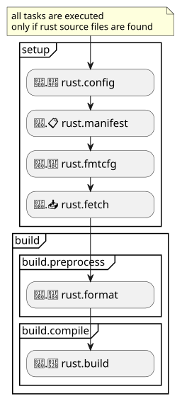

# Tasks

The **`nmk-rust`** plugin defines the tasks described below.

This diagram summarizes the available tasks, and how they are ordered in a given **`nmk`** project:

---

## Setup tasks

All tasks in this chapter are dependencies of the base [**`setup`**](https://nmk-base.readthedocs.io/en/stable/tasks.html#setup-task) task.

---

(rust.config)=

### 🦀.🧰 **`rust.config`** -- Cargo config file generation

This task generates the **{ref}`${rustConfigFile}<rustConfigFile>`** **`cargo`** [configuration file](https://doc.rust-lang.org/cargo/reference/config.html).

| Property | Value/description                                                                                                                               |
| -------- | ----------------------------------------------------------------------------------------------------------------------------------------------- |
| builder  | [nmk_base.common.TomlFileBuilder](https://nmk-base.readthedocs.io/en/stable/autoapi/nmk_base/common/index.html#nmk_base.common.TomlFileBuilder) |
| input    | {ref}`${rustConfigFileFragments}<rustConfigFileFragments>` files                                                                                |
| output   | {ref}`${rustConfigFile}<rustConfigFile>` file                                                                                                   |
| if       | {ref}`${rustSrcFiles}<rustSrcFiles>` are found                                                                                                  |

The builder is called with the following parameters mapping:

| Name           | Value                                                          |
| -------------- | -------------------------------------------------------------- |
| fragment_files | **{ref}`${rustConfigFileFragments}<rustConfigFileFragments>`** |
| items          | **{ref}`${rustConfigFileItems}<rustConfigFileItems>`**         |
| plugin_name    | "nmk-rust"                                                     |

---

(rust.manifest)=

### 🦀.📋 **`rust.manifest`** -- Cargo manifest file generation

This task generates the **{ref}`${rustManifestFile}<rustManifestFile>`** **`cargo`** package [manifest file](https://doc.rust-lang.org/cargo/reference/manifest.html).

| Property | Value/description                                                                                                                               |
| -------- | ----------------------------------------------------------------------------------------------------------------------------------------------- |
| builder  | [nmk_base.common.TomlFileBuilder](https://nmk-base.readthedocs.io/en/stable/autoapi/nmk_base/common/index.html#nmk_base.common.TomlFileBuilder) |
| input    | {ref}`${rustManifestFileFragments}<rustManifestFileFragments>` files                                                                            |
| output   | {ref}`${rustManifestFile}<rustManifestFile>` file                                                                                               |
| if       | {ref}`${rustSrcFiles}<rustSrcFiles>` are found                                                                                                  |

The builder is called with the following parameters mapping:

| Name           | Value                                                              |
| -------------- | ------------------------------------------------------------------ |
| fragment_files | **{ref}`${rustManifestFileFragments}<rustManifestFileFragments>`** |
| items          | **{ref}`${rustManifestFileItems}<rustManifestFileItems>`**         |
| plugin_name    | "nmk-rust"                                                         |

---

(rust.fmtcfg)=

### 🦀.💼 **`rust.fmtcfg`** -- rustfmt config file generation

This task generates the **{ref}`${rustFormatFile}<rustFormatFile>`** **`rustfmt`** [configuration file](https://rust-lang.github.io/rustfmt/).

| Property | Value/description                                                                                                                               |
| -------- | ----------------------------------------------------------------------------------------------------------------------------------------------- |
| builder  | [nmk_base.common.TomlFileBuilder](https://nmk-base.readthedocs.io/en/stable/autoapi/nmk_base/common/index.html#nmk_base.common.TomlFileBuilder) |
| input    | {ref}`${rustFormatFileFragments}<rustFormatFileFragments>` files                                                                                |
| output   | {ref}`${rustFormatFile}<rustFormatFile>` file                                                                                                   |
| if       | {ref}`${rustSrcFiles}<rustSrcFiles>` are found                                                                                                  |

The builder is called with the following parameters mapping:

| Name           | Value                                                          |
| -------------- | -------------------------------------------------------------- |
| fragment_files | **{ref}`${rustFormatFileFragments}<rustFormatFileFragments>`** |
| items          | **{ref}`${rustFormatFileItems}<rustFormatFileItems>`**         |
| plugin_name    | "nmk-rust"                                                     |

---

(rust.fetch)=

### 🦀.📥 **`rust.fetch`** -- Fetch cargo dependencies

This task calls the **`cargo fetch`** command to download and build dependencies of the current package.

| Property | Value/description                                                                                                                             |
| -------- | --------------------------------------------------------------------------------------------------------------------------------------------- |
| builder  | [nmk_base.common.ProcessBuilder](https://nmk-base.readthedocs.io/en/stable/autoapi/nmk_base/common/index.html#nmk_base.common.ProcessBuilder) |
| input    | {ref}`${rustManifestFile}<rustManifestFile>` and {ref}`${rustConfigFile}<rustConfigFile>` files                                               |
| output   | {ref}`${rustFetchStampFile}<rustFetchStampFile>` file                                                                                         |
| if       | {ref}`${rustSrcFiles}<rustSrcFiles>` are found                                                                                                |

The builder is called with the following parameters mapping:

| Name    | Value                                                                    |
| ------- | ------------------------------------------------------------------------ |
| cmd     | ["cargo", "fetch", **{ref}`${rustFetchExtraArgs}<rustFetchExtraArgs>`**] |
| verbose | true                                                                     |

---

## Preprocessing build tasks

All tasks in this chapter are dependencies of the base [**`build.preprocess`**](https://nmk-base.readthedocs.io/en/stable/tasks.html#build-preprocess-task) task.

---

(rust.format)=

### 🦀.💄 **`rust.format`** -- Format rust code files

This task calls the **`cargo fmt`** command (alias to [**`rustfmt tool`**](https://github.com/rust-lang/rustfmt)) to format rust code files.

| Property | Value/description                                                                                                                             |
| -------- | --------------------------------------------------------------------------------------------------------------------------------------------- |
| builder  | [nmk_base.common.ProcessBuilder](https://nmk-base.readthedocs.io/en/stable/autoapi/nmk_base/common/index.html#nmk_base.common.ProcessBuilder) |
| input    | {ref}`${rustSrcFiles}<rustSrcFiles>` files                                                                                                    |
| output   | {ref}`${rustFormatStampFile}<rustFormatStampFile>` file                                                                                       |
| if       | {ref}`${rustSrcFiles}<rustSrcFiles>` are found                                                                                                |

The builder is called with the following parameters mapping:

| Name | Value                                                                    |
| ---- | ------------------------------------------------------------------------ |
| cmd  | ["cargo", "fmt", **{ref}`${rustFormatExtraArgs}<rustFormatExtraArgs>`**] |

---

## Compilation build tasks

All tasks in this chapter are dependencies of the base [**`build.compile`**](https://nmk-base.readthedocs.io/en/stable/tasks.html#build-compile-task) task.

---

(rust.build)=

### 🦀.🔨 **`rust.build`** -- Compile rust code files

This task calls the **`cargo build`** command to compile rust code files, and generate binary crate(s) executable(s).

| Property | Value/description                                                                                                                             |
| -------- | --------------------------------------------------------------------------------------------------------------------------------------------- |
| builder  | [nmk_base.common.ProcessBuilder](https://nmk-base.readthedocs.io/en/stable/autoapi/nmk_base/common/index.html#nmk_base.common.ProcessBuilder) |
| input    | {ref}`${rustManifestFile}<rustManifestFile>` + {ref}`${rustConfigFile}<rustConfigFile>` + {ref}`${rustSrcFiles}<rustSrcFiles>` files          |
| output   | {ref}`${rustBuildStampFile}<rustBuildStampFile>` file                                                                                         |
| if       | {ref}`${rustSrcFiles}<rustSrcFiles>` are found                                                                                                |

The builder is called with the following parameters mapping:

| Name | Value                                                                    |
| ---- | ------------------------------------------------------------------------ |
| cmd  | ["cargo", "build", **{ref}`${rustBuildExtraArgs}<rustBuildExtraArgs>`**] |
